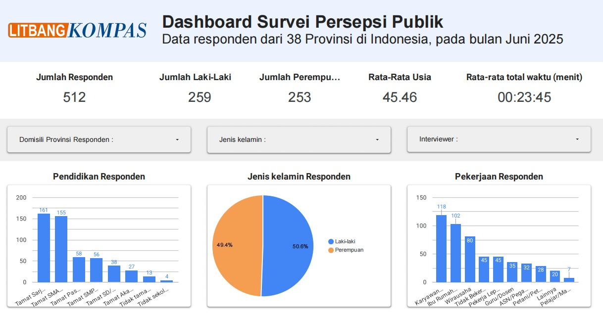
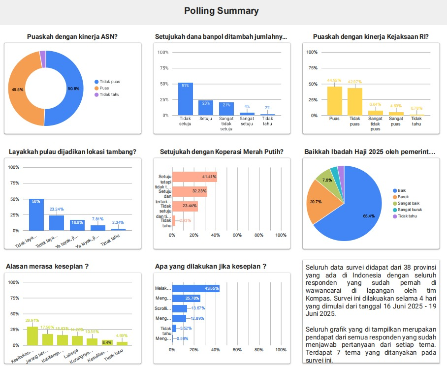
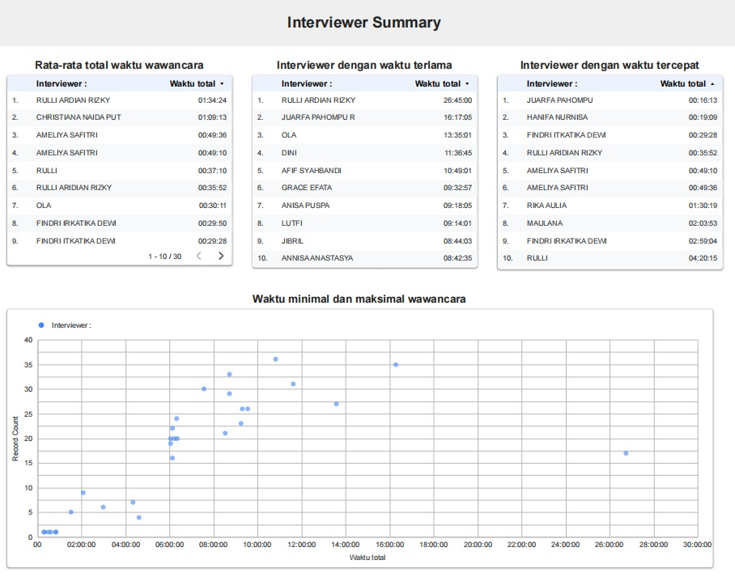

# Dashboard Survei Persepsi Publik – Litbang Kompas

This project was developed during my internship at Litbang Kompas. The dashboard visualizes survey data on public perception to extract meaningful insights for research purposes.

---

## 📊 Dashboard Overview

### 1. Survey Overview

### 2. Public Perception Analysis

### 3. Demographic Insights

---

## 🧠 Key Insights
- Public sentiment is mostly neutral to positive across surveyed topics
- Differences in perception are influenced by demographic factors
- Certain groups show more consistent response behavior

---

## 🛠️ Tools Used
- Looker Studio / Power BI (sesuaikan yang kamu pakai)
- Excel / data preprocessing tools
- Survey dataset from Litbang Kompas

---

## 🎯 Purpose
To transform raw survey responses into actionable insights that support research and decision-making processes.
