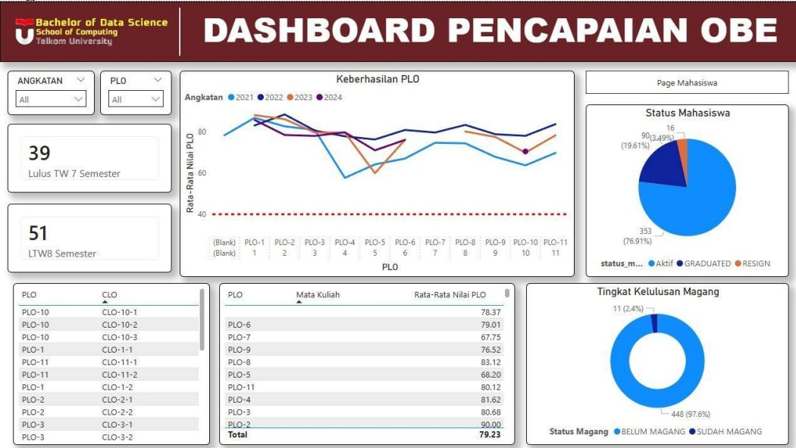
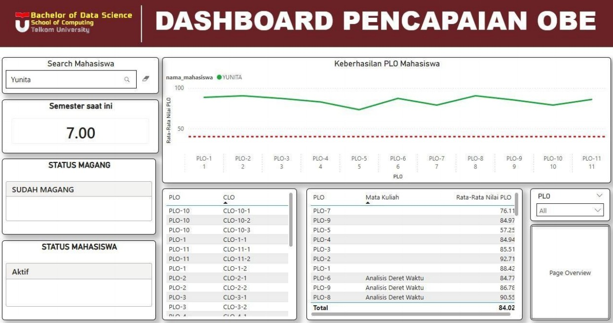

# OBE Academic Analytics Dashboard

This project is an interactive academic analytics dashboard developed using Power BI. It was designed to support program study (prodi) stakeholders in monitoring student academic performance under the Outcome-Based Education (OBE) framework.

The dashboard helps evaluate CLO (Course Learning Outcomes) and PLO (Program Learning Outcomes) achievement levels to identify students who require academic improvement.

---

## 🎯 Project Context

The dashboard was developed with the study program (prodi S1 Data Science) as the primary stakeholder. It aims to provide data-driven insights for academic evaluation, student performance monitoring, and institutional reporting.

---

## 📊 Dashboard Structure

### 1. Overview Page
This page presents a high-level summary of all students in the study program.

It includes:
- Aggregate student performance metrics
- Overall PLO/CLO achievement distribution
- Summary tables and key performance indicators (KPIs)
- Visual comparison across cohorts or groups

📌 Purpose:
To provide a general overview of academic performance at the program level.

---

### 2. Student Detail Page
This page focuses on individual student performance.

It includes:
- Student-specific performance metrics
- CLO and PLO achievement per student
- Visual breakdown of strengths and weaknesses
- Interactive filters to select individual students

📌 Purpose:
To analyze individual student performance and identify those who are underperforming or need academic support.

---

## 🧠 Key Insights

- Some students show gaps in CLO/PLO achievement that require intervention
- Performance distribution varies across cohorts
- Combining overview and individual analysis improves academic decision-making
- Filtering capability allows personalized academic monitoring

---

## 🛠️ Tools Used

- Power BI
- SQL
- Google Sheets / Excel

---

## 🎯 Objective

To support Outcome-Based Education (OBE) evaluation by providing interactive dashboards that help study programs monitor both macro-level (program) and micro-level (student) academic performance.

---

## 📌 Impact

This dashboard enables data-driven academic decision-making by helping lecturers and program administrators identify students who need additional academic support based on CLO and PLO performance metrics.
